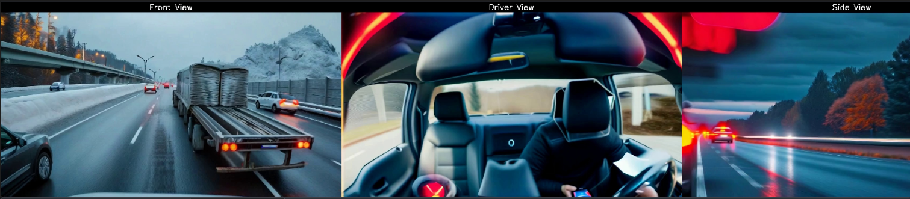

# Video Analysis Application

## Overview

This application processes near real-time multi-camera video feeds captured from highway vehicles using Amazon S3, AWS Lambda, and Amazon Nova Pro model to perform automated analysis of traffic patterns and safety concerns. The system detects and analyzes potential hazards including:

- Vehicle proximity warnings
- Lane departure risks
- Sudden brake events
- Unsafe merging behavior
- Adverse weather conditions
- Road obstacles and debris

The analysis pipeline works in two stages:

- Video Processing: The application processes multi-camera video feeds in near real-time, converting them into synchronized frame sequences for comprehensive vehicle surroundings coverage.
- Intelligent Analysis: Using Amazon Nova Pro model, the system analyzes the combined frames to generate detailed event summaries and risk assessments, with typical processing latency of a few seconds.

The outcomes are delivered through:

- Near real-time driver alerts via dashboard integration
- Mobile app notifications for fleet managers
- Detailed event logs for safety analysis
- Weekly/monthly safety reports for fleet optimization

This approach to hazard detection and driver notification helps prevent accidents and improve overall road safety while building a valuable database of traffic patterns and risk scenarios.

Below is a composite image frame that demonstrates how the application synchronizes and combines footage from multiple vehicle cameras to create a comprehensive view of the vehicle's surroundings:


Below is a representative analysis output from the Amazon Nova Pro model, demonstrating how the system identifies and categorizes potential road hazards and safety concerns:

```json
{
  "severity": "high",
  "summary": "The observations indicate a high-risk situation primarily due to distracted driving. The driver is using a mobile phone, significantly increasing the likelihood of an accident. Additionally, the close proximity of vehicles, especially behind a large truck, poses a risk of rear-end collisions if the driver is not attentive. The varying speeds of vehicles and predominant use of the left lane also contribute to potential safety hazards. Environmental conditions are currently clear, but the overcast sky could affect visibility if it leads to rain."
}
```

## Architecture


## Deployment

### Prerequisites

- AWS Account with appropriate permissions
- Node.js 18.x or later
- AWS CDK CLI installed (`npm install -g aws-cdk`)
- TypeScript knowledge for infrastructure customization
- Python 3.12 or later
- AWS CLI installed and configured
- Docker (for local development)
- Model access to Amazon Nova Pro 
- Inference profile ARN for using Amazon Nova Pro
- 3 video files that show views of the road on the front, and side, and a driver facing view (you can use the samples files included in this project. These sample synthetic videos are generated by Amazon Nova Reel)

### Clone repository

   Clone this repository and change directory to the folder shown below

   ```bash
   cd sample-ai-driver-safety-helper
   ```

### Local Testing

   ```bash
   cd app
   python -m venv .venv
   source .venv/bin/activate  # On Windows use: .venv\Scripts\activate
   pip install -r requirements.txt
   # Replace the <account_id> with your AWS Account ID
   python detect.py \
      --front-video ./samples/front.mp4 \
      --driver-video ./samples/driver.mp4 \
      --side-video ./samples/side.mp4 \
      --inference-profile "arn:aws:bedrock:us-east-1:<accound_id>:inference-profile/us.amazon.nova-pro-v1:0" \
      --output-dir output_frames \
      --target-fps 1 
   ```

### Jupyter notebook

Make sure to clone the repository and open the notebook called "sample-ai-driver-safety-helper/notebooks/summarize-driver-videos.ipynb" in Amazon SageMaker Studio Lab or Amazon SageMaker AI. Follow the instructions in the notebook to summarize the videos provided in the "app/samples" folder.

### Cloud deployment

- Initialize and configure the CDK environment (this is a Node.js managed CDK project):

   ```bash
   # Install Node.js dependencies
   cd cdk
   npm install   
   npm audit # this step is to confirm there are no vulnerabilities with the installed packages
   cd ..
   ```

- Bootstrap your AWS environment (if not already done):

   ```bash
   cdk bootstrap
   ```

- Deploy the application with the required inference profile ARN:

   ```bash
   cd cdk
   # Replace the <account_id> with your AWS Account ID
   cdk deploy --context inference_profile_arn=arn:aws:bedrock:us-east-1:<accound_id>:inference-profile/us.amazon.nova-pro-v1:0
   ```

The deployment will create:

- An S3 bucket for video uploads
- A Lambda function for video processing
- Required IAM roles and permissions

### Cloud Testing

- Upload the sample videos ("front.mp4", "driver.mp4", "side.mp4") included in this project to the created S3 bucket.

- Execute the Lambda function:

  - Invoke the Lambda function with your video files from the Lambda console using the sample event format shown below

   ```json
   {
   "front_video_key": "front.mp4",
   "driver_video_key": "driver.mp4",
   "side_video_key": "side.mp4"
   }
   ```

   When the Lambda function completes, you will see the summary of the video analysis.

   ```json
   {
      "statusCode": 200,
      "body": {
         "message": "Successfully analyzed 13 frames",
         "summary": "{\n  \"severity\": \"high\",\n  \"summary\": \"The footage from synchronized camera views shows a busy highway with multiple vehicles, including trucks and cars. The driver is observed using a mobile device while driving, which is a significant safety concern. The road appears to be wet, indicating recent rain, which could increase the risk of hydroplaning and reduce vehicle traction. The traffic flow is heavy, with vehicles closely spaced, which could lead to increased chances of rear-end collisions if sudden stops occur. The overall scene suggests a need for heightened awareness and caution due to the combination of wet conditions and driver distraction.\"\n}"
      }
   }   
   ```

## Cleanup

To avoid incurring charges, clean up the resources when no longer needed:

- Remove the CDK stack:

   ```bash
   cd cdk
   cdk destroy
   ```
- Note: You might need to manually delete the content of S3 bucket. 

## Security

- The input S3 bucket is setup to block public access, enforce SSL, and with a lifecycle policy
- The process Lambda function's IAM role is setup with the minimum permissions required for S3, and Bedrock access
- Amazon Q Developer full project scan run reported 0 issues
- S3 permissions: Uses the S3 bucket's `grantRead()` method which creates least-privilege read permissions
- Bedrock permissions: Uses a specific policy statement with exact actions needed:
  - `bedrock:InvokeModel`
  - `bedrock:InvokeModelWithResponseStream`
- cdk_nag library and bandit tool are used to confirm infrastructure and application code patterns are using secure constructs
- Amaozn Bedrock model invocation logging is disabled by default and can be enabled by following these [steps](https://docs.aws.amazon.com/bedrock/latest/userguide/model-invocation-logging.html)


